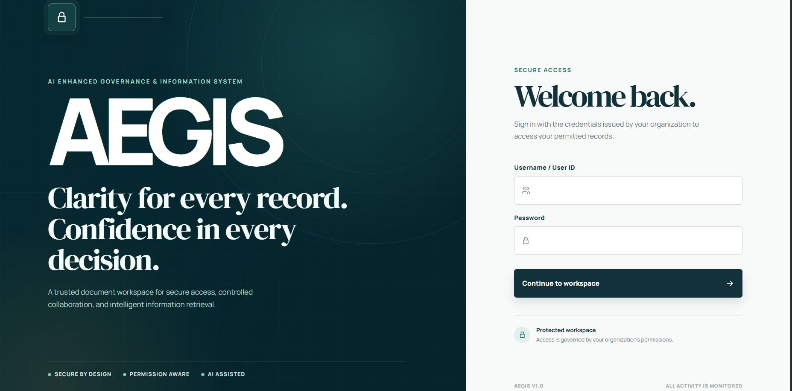
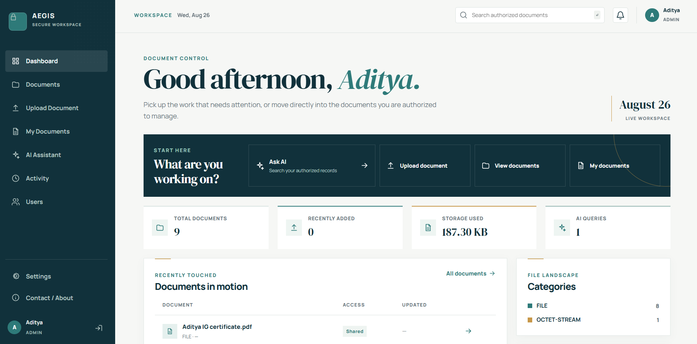
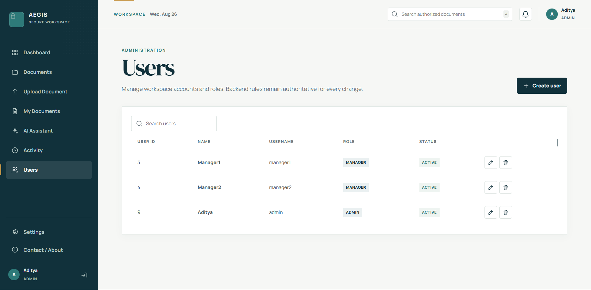
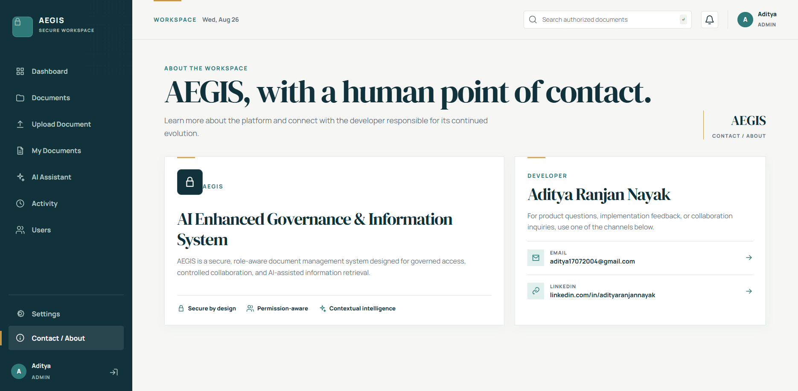

# AEGIS — Screenshots

This section showcases the main interfaces of **AEGIS (AI-Enhanced Governance & Information Security)**, including authentication, document management, AI-powered document interaction, activity tracking, and administration.

---

## Login & Authentication

---

## Dashboard

---

## Document Management

---

## Upload Document

---

## AI Assistant & RAG

---

## Activity Tracking

---

## User Management

---

## Profile & Settings

